# Every Pattern Tile

Twenty-four tiles, one factory each. Each one is a `<pattern>` element and the `url(#id)` that
references it, and each one joins with itself: what leaves through one edge comes back through
the opposite one, so a filled surface shows no seam and no shape cut at a boundary.

Seventeen are ruled by geometry. The other seven take a `seed`: their disorder is enclosed in a
larger tile that still repeats. How noticeable that repeat is depends on its size and the surface.

Every figure below is the tile its page documents, filling a surface.

<figure><a href="dots.md">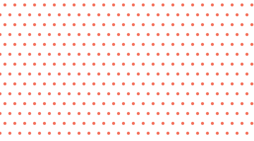</a><figcaption><a href="dots.md">dots</a></figcaption></figure>
<figure><a href="stripes.md">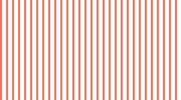</a><figcaption><a href="stripes.md">stripes</a></figcaption></figure>
<figure><a href="crosshatch.md">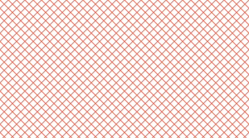</a><figcaption><a href="crosshatch.md">crosshatch</a></figcaption></figure>
<figure><a href="grid.md">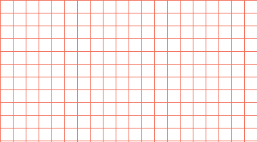</a><figcaption><a href="grid.md">grid</a></figcaption></figure>
<figure><a href="triangles.md">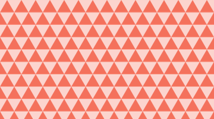</a><figcaption><a href="triangles.md">triangles</a></figcaption></figure>
<figure><a href="honeycomb.md">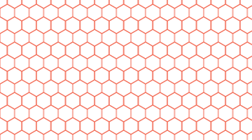</a><figcaption><a href="honeycomb.md">honeycomb</a></figcaption></figure>
<figure><a href="scales.md">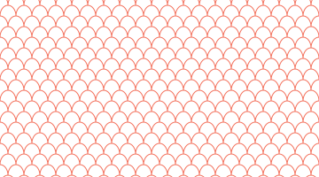</a><figcaption><a href="scales.md">scales</a></figcaption></figure>
<figure><a href="herringbone.md">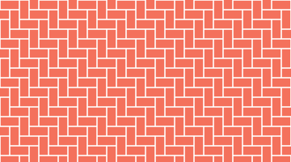</a><figcaption><a href="herringbone.md">herringbone</a></figcaption></figure>
<figure><a href="chevron.md">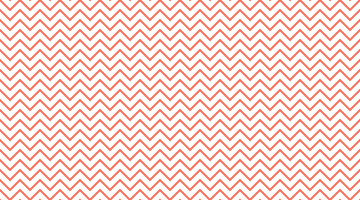</a><figcaption><a href="chevron.md">chevron</a></figcaption></figure>
<figure><a href="houndstooth.md">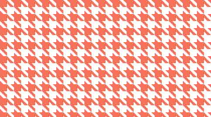</a><figcaption><a href="houndstooth.md">houndstooth</a></figcaption></figure>
<figure><figcaption><a href="isometric-cubes.md">isometricCubes</a></figcaption></figure>
<figure><a href="asanoha.md">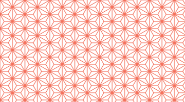</a><figcaption><a href="asanoha.md">asanoha</a></figcaption></figure>
<figure><a href="seigaiha.md">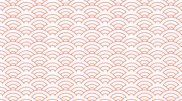</a><figcaption><a href="seigaiha.md">seigaiha</a></figcaption></figure>
<figure><a href="flower-of-life.md">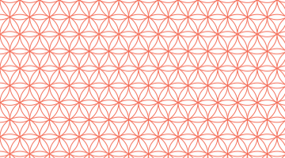</a><figcaption><a href="flower-of-life.md">flowerOfLife</a></figcaption></figure>
<figure><a href="checker.md">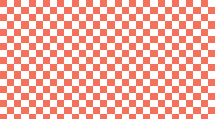</a><figcaption><a href="checker.md">checker</a></figcaption></figure>
<figure><a href="quatrefoil.md">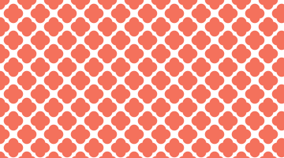</a><figcaption><a href="quatrefoil.md">quatrefoil</a></figcaption></figure>
<figure><a href="greek-key.md">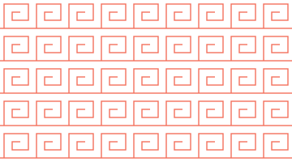</a><figcaption><a href="greek-key.md">greekKey</a></figcaption></figure>
<figure><a href="truchet.md">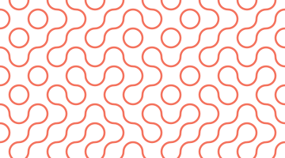</a><figcaption><a href="truchet.md">truchet</a></figcaption></figure>
<figure><a href="jittered-dots.md">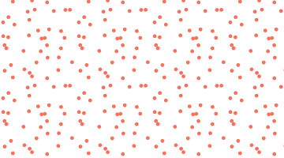</a><figcaption><a href="jittered-dots.md">jitteredDots</a></figcaption></figure>
<figure><a href="rough-hatch.md">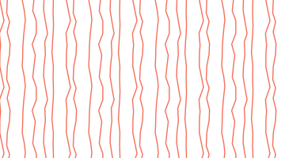</a><figcaption><a href="rough-hatch.md">roughHatch</a></figcaption></figure>
<figure><a href="staggered-bricks.md">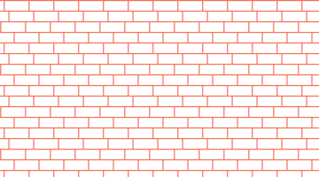</a><figcaption><a href="staggered-bricks.md">staggeredBricks</a></figcaption></figure>
<figure><a href="confetti.md">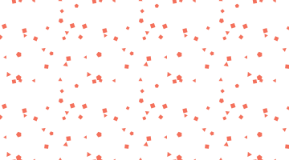</a><figcaption><a href="confetti.md">confetti</a></figcaption></figure>
<figure><a href="voronoi.md">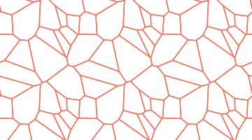</a><figcaption><a href="voronoi.md">voronoi</a></figcaption></figure>
<figure><a href="mosaic.md">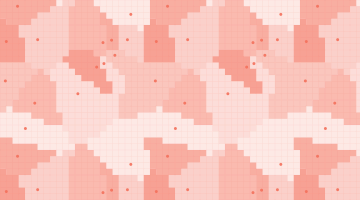</a><figcaption><a href="mosaic.md">mosaic</a></figcaption></figure>

## Choosing one

| You want | Use |
| --- | --- |
| an even texture that reads as tone | [dots](dots.md), with `stagger` to break the lattice |
| shading that darkens without a solid fill | [crosshatch](crosshatch.md), or [roughHatch](rough-hatch.md) for a drawn look |
| a background measure behind a plan | [grid](grid.md), or [dots](dots.md) with `phase` for its nodes alone |
| bands at an angle | [stripes](stripes.md) with `withAngle()` |
| a surface with a direction | [chevron](chevron.md), or [scales](scales.md) |
| a mesh that reads as structure | [honeycomb](honeycomb.md) |
| transparency showing through | [checker](checker.md) |
| a texture with a larger, less regular repeat | [truchet](truchet.md), [jitteredDots](jittered-dots.md), or [confetti](confetti.md) |
| masonry | [staggeredBricks](staggered-bricks.md) |
| cloth | [houndstooth](houndstooth.md) |
| an organic mesh, closer to cracked glaze than to a rule | [voronoi](voronoi.md), filled or as edges alone |
| the same territories set as tesserae, on a grid | [mosaic](mosaic.md) |
| a fine lattice with more structure than a crosshatch | [asanoha](asanoha.md) |
| a flat surface that reads as volume | [isometricCubes](isometric-cubes.md) |
| the third regular tessellation, after the square and the hexagon | [triangles](triangles.md) |
| a bond where every brick is turned against the last | [herringbone](herringbone.md) |
| the wave of Japanese textile | [seigaiha](seigaiha.md) |
| circles closing into rosettes | [flowerOfLife](flower-of-life.md) |
| a curved lattice, closer to a screen than to a grid | [quatrefoil](quatrefoil.md) |
| a running ornament drawn as one line | [greekKey](greek-key.md) |
